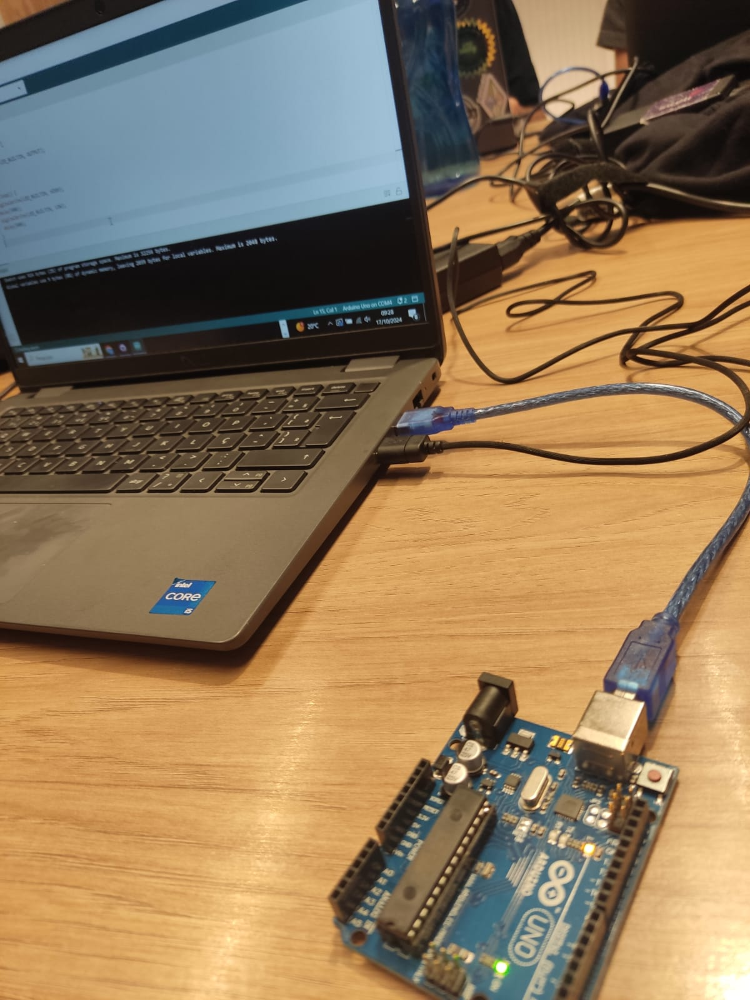

### Parte 1 - Piscar LED no Arduino Uno

Conforme solicitado na atividade 1, o código foi desenvolvido para acionar o LED integrado do Arduino Uno. Através do **pinMode()**, o pino do LED integrado (LED_BUILTIN) é configurado como saída. No loop principal, utilizamos a função **digitalWrite()** para alternar o estado do LED entre ligado (**HIGH**) e desligado (**LOW**), com um intervalo de 500 milissegundos entre cada mudança, controlado pela função **delay()**. Esse processo faz com que o LED integrado do Arduino pisque continuamente a cada 500ms.

<div align="center">
<sub>Figura 1 - led </sub><br>
<br>
<sup>Fonte: Material produzido pelo autor (2024)</sup>
</div>


Para ver o vídeo consulte [este link](https://youtube.com/shorts/Ly-zNU17j2g?si=9vx52OHsodNeXUFh).


## Código:


```c++


void setup() {
 
  pinMode(LED_BUILTIN, OUTPUT);

}

void loop() {
  digitalWrite(LED_BUILTIN, HIGH);  
  delay(500);                      
  digitalWrite(LED_BUILTIN, LOW);   
  delay(500);                      
}
```


Parte 2: fazer o arduino funcionar com a protoboard e led + ir além -- acionar o led com o botão

<div align="center">
<sub>Figura 2 - led na protoboard</sub><br>
<br>
<sup>Fonte: Material produzido pelo autor (2024)</sup>
</div>


Para ver o vídeo da parte 2 consulte [este link](https://youtu.be/eKTTlFmrmZs?si=GLFRzknZSyfC1RhR).


Este código permite controlar um LED com um botão, utilizando o resistor pull-up interno do Arduino. No setup, o pino 11 é configurado como saída para o LED, enquanto o pino 12 é configurado como entrada com INPUT_PULLUP, garantindo que ele permaneça em estado alto (HIGH) quando o botão não estiver pressionado. No loop principal, o código monitora o estado do botão. Quando o botão é pressionado (estado LOW), o LED acende. Caso contrário, o LED permanece desligado. Isso demonstra como controlar dispositivos simples com o uso de botões e resistores pull-up internos.


